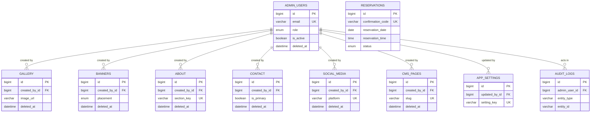

# ORA DE NUIT database architecture

## Design principles

- **MySQL 8 / InnoDB / utf8mb4** preserves transactions, referential integrity, and full Unicode restaurant and guest data.
- **BIGINT unsigned primary keys** are safe for long-lived operational data. Prisma exposes them as JavaScript `BigInt` values.
- **UTC timestamps** are required at the application/connection level; MySQL `DATETIME(3)` preserves milliseconds without session-time-zone conversion.
- **Soft deletes** (`deleted_at`) protect CMS and identity records from accidental loss. Queries for public content must include `deleted_at IS NULL`.
- **Reservations and audit logs are append-only operational records**. Cancellations are represented with status and cancellation metadata—not deletion—so history is preserved.
- **JSON is narrowly used** for schemaless configuration, opening-hours, and before/after audit snapshots; searchable operational fields remain relational columns.

## Table responsibilities

| Table          | Purpose                                                                                                                                                                         |
| -------------- | ------------------------------------------------------------------------------------------------------------------------------------------------------------------------------- |
| `reservations` | Guest booking record. Holds guest contact, schedule, party size, source, lifecycle status, and cancellation data. The unique confirmation code is the public lookup identifier. |
| `gallery`      | Curated restaurant images. Supports categorization, accessibility alt text, display order, publishing and soft deletion.                                                        |
| `banners`      | Time-bound promotional/hero content. Placement, publication flag, dates, display order, and optional CTA support mobile app presentation.                                       |
| `about`        | Ordered, publishable sections of the restaurant story. `section_key` gives stable CMS identity such as `our-story` or `philosophy`.                                             |
| `contact`      | Restaurant contact/location records including address, coordinates, and opening-hours JSON. It permits a future multi-location setup without schema changes.                    |
| `social_media` | One configured link per platform, with ordering and visibility controls.                                                                                                        |
| `cms_pages`    | Slug-addressable long-form pages with SEO metadata and publication lifecycle.                                                                                                   |
| `app_settings` | Key/value configuration registry. JSON permits structured values while `is_public` safely separates app-readable from internal settings.                                        |
| `admin_users`  | CMS/operator identities, password hashes, role, active state, login timestamp, and soft deletion. Passwords are never stored in plain text.                                     |
| `audit_logs`   | Immutable administrative activity trail. JSON snapshots record state changes and actor metadata supports forensic review.                                                       |

## Index strategy

- Reservation schedule lookup: `(reservation_date, reservation_time, status)` supports availability and operations views.
- Guest email/phone indexes support customer-service lookup without table scans.
- Public-content composite indexes start with filter fields (`is_published`, placement where applicable), followed by display/time fields.
- Audit composites support the two common investigation paths: by entity and by acting administrator.
- Unique indexes enforce confirmation-code, email, setting-key, slug, platform, and section-key identity.

## ER diagram

`reservations` intentionally has no customer foreign key yet: the requested mobile application has no customer identity table. This avoids manufacturing an incorrect dependency. A future `customers` table can be added with a nullable `customer_id` foreign key and a backfill strategy.
